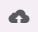
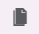
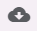

# Portal do desenvolvedor

Para desenvolver uma feature é necessário ser convidado por uma instituição cliente da GVDASA usuário do GVmobile, para ter o acesso ao Portal de Desenvolvimento GVmobile https://painel.gvmobile.net.br/. Neste Portal do Desenvolvedor podemos verificar as features do cliente, o que foi desenvolvido e informações sobre o cliente e aplicações.

## Envio/upload de Features

Para o envio/upload de uma feature via portal, temos duas maneiras: [primeiro envio](#primeiro-envio) ou uma [atualização do envio](#atualizacao-do-envio)

### Primeiro envio

Para efetuar o upload clique no botão "Adicionar" e preencha os campos:

* **Feature** - nome da feature deve ser exatamente o mesmo presente no arquivo feature.json conforme especificado na documentação, [link](features.md#featurejson);
* **Arquivo** - campo para seleção do arquivo o qual deve ter **exatamente** o mesmo nome do alias e com a extensão **.zip** contendo todos os arquivos da sua feature;
	* eg: HelloWorldTest2.zip
* **Habilitar teste** - define se sua feture já será disponibilizada para testes no aplicativo assim que for enviada.

### Atualização do envio

Para efetuar o upload, clique na feature que deseja atualizar e clique no botão  e escolha o arquivo **.zip** que contem a atualização da feature

## Habilitando/desabilitando uma feature para testes

Quando uma feature esta marcada para testes, ela pode ser acessada com o [aplicativo em modo desenvolvedor](aplicativo_desenvolvedor.md) sem restrições.

Para habilitar ou desabilitar o modo de testes, clique na feature e após, clique em "Habilitar teste" ou "Desabilitar teste".

## Publicando uma feature

Quando uma feature esta pronta para entrar em modo produção, devemos publicar esta feature. Para publicar uma feature, clique na feature e após, clique em "Publicar".

**Atenção**: Esta ação inicia um build automatizado, e pode levar alguns minutos para aplicar as alterações na produção. Se o cliente não der permissões de acesso na feature, a mesma não será possivel acessar no dispositivo.

## Copiar uma feature

Se houver a necessidade da alteração de uma feature, podemos fazer uma cópia desta e criar uma nova feature a partir desta.

Para fazer uma cópia, devemos clicar na feature que será copiada e após, clicar em , e preencha os campos:

* **Feature**: nome da feature deve ser exatamente o mesmo presente no arquivo feature.json conforme especificado na documentação, [link](features.md#featurejson).
* **Origem**: é a origem do código. Este pode ser da **produção** ou do **desenvolvimento**. Se não houver uma versão de desenvolvimento, será sempre a versão de produção.
* **Habilitar teste** - define se sua feture já será disponibilizada para testes no aplicativo assim que for enviada.

## Download de uma feature

Para obter o código de uma feature que você já desenvolve ou que você recentemente fez cópia, apenas selecione a feature e clique em .

## Obter informações para do cliente e aplicativo

Normalmente quando usamos o [GVMSDK](gvmsdk.md) para enviar ou atualizar features no portal, precisamos de informações do cliente ou do aplicativo que estamos enviando.

Para obter informações acesse *Aplicativos* e selecione o cliente e clique em *Status*. Nesta tela temos informações importantes como status do build de produção e o de testes, versão da features em produção e testes, bem como informações do aplicativo, como o PackageId e o Cliente Id.

